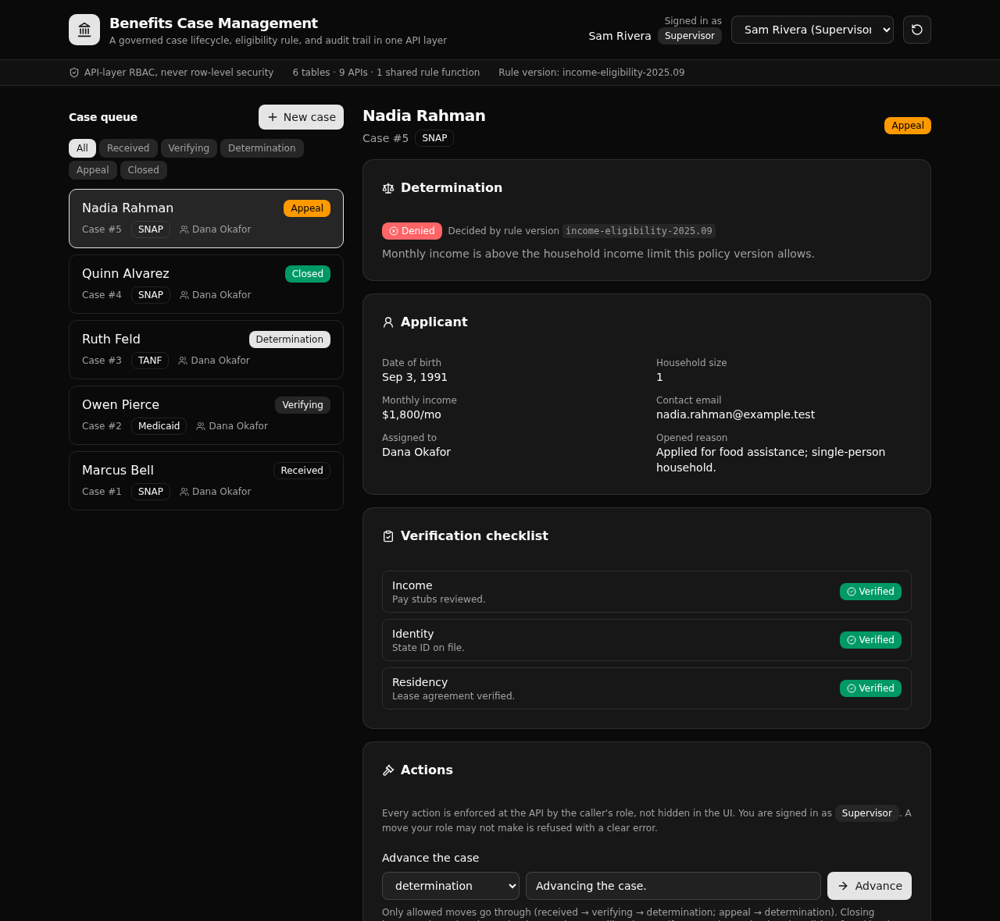

# Benefits Case Management Backend

A governed backend for a government benefits agency. Each application becomes a case that moves through an enforced lifecycle, role checks gate every step, one versioned rule decides each case, and every move is written to an audit trail.

`6 tables · 9 APIs · 1 function`



## What it demonstrates

This is Xano's **Backend Modernization** play made concrete, for the **government** vertical. It stands in for a legacy benefits case system, and it puts the parts a technical evaluator cares about in one place they can read:

- **A real state machine.** A case moves `received → verifying → determination → closed`, and a closed case can go to `appeal` and back. Illegal moves (like `received → closed`) are refused at the API, and nothing is written.
- **API-layer RBAC, never row-level security.** A caseworker, a supervisor, and a viewer each get a different set of actions. The role check lives in each endpoint, reading the caller's own row. Xano's access control is at the API layer, so that is where the rules are.
- **One versioned eligibility rule.** A single shared function decides every case: all three checks verified, and income within the household limit. The determination is pinned to the rule version that produced it, so it stays auditable after the policy changes.
- **An append-only audit trail.** Every change writes one `case_events` row: who acted, their role, the status it moved from and to, and why.

The frontend calls these endpoints and shows the governed result, so a reviewer can walk a case end to end and watch the rules hold.

## Repo layout

```
xano/
├── index.ts                     the workspace, registering everything below
├── tables/                      users, applicants, cases, verifications,
│                                determinations, case_events
├── functions/
│   └── evaluate-eligibility.ts  the versioned rule, called by decide + seed
└── api/
    ├── groups.ts                one API group per resource (pinned canonicals)
    ├── auth-login.ts            mint a token from the users auth table
    ├── cases-*.ts               intake, list, get, advance
    ├── verifications-record.ts  record a check
    ├── determinations-decide.ts run the rule, close the case
    ├── appeals-file.ts          appeal a denied, closed case
    └── seed.ts                  reset + reseed the demo data
frontend/                        React + Vite + Tailwind + shadcn/ui
└── src/lib/api.ts               the one contract: paths + types from the defs
```

## API surface

| Verb | Path | Who | What it enforces |
| --- | --- | --- | --- |
| POST | `/api:auth/login` | public | Verifies the password and mints a bearer token. |
| POST | `/api:cases/intake` | caseworker | Matches or creates an applicant, opens a case in `received`. |
| GET | `/api:cases/list` | any signed-in role | The queue, filterable by status and assignee. |
| GET | `/api:cases/get/{case_id}` | any signed-in role | One case with its checks, determination, and full history. |
| POST | `/api:cases/advance` | caseworker, supervisor | A legal transition only, else a clear error and no write. |
| POST | `/api:verifications/record` | caseworker | Records a check while the case is `verifying`. |
| POST | `/api:determinations/decide` | supervisor | Runs the shared rule and closes the case on the outcome. |
| POST | `/api:appeals/file` | caseworker, supervisor | Moves a denied, closed case back to `appeal`. |
| GET | `/api:seed/seed` | public | Resets and reseeds the sample data. |

Every path and every request and response type in the frontend is derived from these query defs (`getPath()`, `InferInput`, `InferResponse`). Change a def and the frontend follows at compile time, so a drifting URL or body is a build error, not a runtime surprise.

## Quick start

You need Node 20.19 or newer and a free Xano account.

```bash
git clone https://github.com/xano-scratch/benefits-case-management-backend
cd benefits-case-management-backend
npm install
npx xanots login          # one-time browser auth with Xano
npm run xano:deploy       # builds the frontend, deploys, prints the live URL
```

`npm run xano:deploy` deploys the backend and the built frontend to a fresh, auto-expiring Xano environment and prints its URL. Open the frontend, and sign in as one of the seeded staff:

- `dana@agency.example` / `caseworker-demo` (caseworker)
- `sam@agency.example` / `supervisor-demo` (supervisor)
- `val@agency.example` / `viewer-demo` (viewer)

The app seeds itself on first load, so the queue has cases at every stage right away.

## FAQ

**Is this row-level security?** No. Access is checked at the API layer. Each endpoint reads the caller's role from their user row and gates on it. That is how access control works in Xano.

**Where does the eligibility rule live?** In one function, `evaluate_eligibility`. The `decide` endpoint and the seed both call it, so the live decision and the sample data come from the same definition. To change the policy, edit the limits and move the version string.

**Can I trust the demo data?** It is sample data for a scratch environment, not a real agency. The seed builds five cases that cover the whole lifecycle, including one denial with an open appeal.

**How do I reset it?** Call `GET /api:seed/seed`, or use the reset button in the app header. It truncates the tables and reseeds.

---

Built with [xanots](https://www.npmjs.com/package/@xanots/sdk), the TypeScript SDK for Xano. This is a demonstration backend, not a live production reference.
